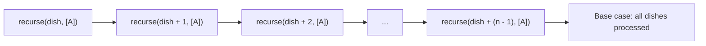

# DSA
Codes + problem explanation

## TODO
1) Figure out if cumulative sum / prefix sum could work with memoisation, memoisation that I write is from (0 -> n), but as recursion stores answer during the 2nd pass(during backtracking) it stores the answer (n -> level), so the memo[level] = lower part of tree (level -> n OR n -> level). Iterative DP, does 1 pass stores the answer from (0-> level) in memo[level]. So a valid workaround could be to write recursion from (n -> 0), so that the answer being stored in memo[level] is from (0-> level), which would make it analogous to iterative version. (If possible, then solve Flowers(CF) and Python Indentation(CF) again but with memo)

2) Practice JUMP DP questions more or the DP questions where memo keys can be dropped via loop or binary search. DO BOTH - COAXIAL / SUBSEQUENCE WITH JUMPS (SORT ON 1 PARAM, binary search on that sorted param with another param being the query, like PROJECTS CSES) and 2 AXIS (LIS TYPE, sort in 1 direction, LIS on OTHER)

3) IMPORTANT OBSERVATION-
### Assign less things to more people => generates PERMUTATION and you have track state of assignment into further states.
**Permutation or state tracking are enemies of DP, you cannot optimise:**
1) permutation = each path in tree, is unique => so no common subproblems
2) state tracking = If you maintaining states of objects (visited / used array in recursion, sets to identify which items have been used), it will become part of memo key. But a vector in memo key is less likely to generate LESS OVERLAP BETWEEN SUBPROBLEMS, as there will be many different configurations of the STATE TRACKING ARRAY. So **CONCLUSION**
#### RECURSIVELY SOLUTION POSSIBLE , BAD FOR DP (not possible to write DP)

### Assign more things to less people => Generates CHOICES => will you be assigned or not (INC / EXC).
Much better way to think, as it can be optimised efficiently, as it creates MANY OVERLAPS between SUBPROBLEMS.
Assigning more things, gives each of thing / elements only 2 option: Either be assigned or not
#### RECURSIVELY SOLUTION POSSIBLE , VERY GOOD FOR DP

INTUITIVE THINKING: 
If you have to assign more things to less people OR more boxes to less balls (IFF. there is 1 - 1 mapping, i.e. each person get only 1 item), it is obvious that some things will be left unassigned as #things > #people. So for this to happen, each element will have a choice to be assigned or not, which builds the choice diagram tree or inc/exc tree.

If you have to assign less people to more things or less balls to more boxes, each person will have a choice to pick which item, OR each ball will have a choice to go to which box. Which essentially generates permutations or permutation tree.

**IMPORTANT VIDEO REFERENCE** 
#### {FUCKING CRAZY DO WATCH THIS, NEVER REALISED WHAT THE IMPORTANCE OF THOSE PERMUATION COMBINATION VIDEOS WERE & HOW IMPORTANT THEY ARE TO WRITE GOOD VS BAD DP SOLUTION}

PEPCODING RECURSION LEVEL 2 (Generate permutation choices for r balls in N boxes & combination choices for N boxes to be assigned to r balls), where N > r
[https://www.youtube.com/watch?v=QKkHCS5bq0I&list=PL-Jc9J83PIiHO9SQ6lxGuDsZNt2mkHEn0&index=20]{permutation generation}
[https://www.youtube.com/watch?v=wOaxJAtJ2Mo&list=PL-Jc9J83PIiHO9SQ6lxGuDsZNt2mkHEn0&index=21] {combination generation}


**IMPORTANT PROBLEM**
CHEF MONOCARP CODEFORCES / ASSIGNMENT DP 
Observation 1: #number of dishes < #number of timeslots
(**NOT EVERY** TIME SLOTS IS GOING TO BE USED, BUT **EVERY** DISH NEEDS TO BE TAKEN OUT)

This problem if to be solved via recursion, can be solved in both ways:
1) assign less dishes to more timeslots
2) assign more timeslots to less dishes

1st Method:
Assign less to more => Assign EACH dish A time slot => Ask, CURRENT DISH SHOULD BE TAKEN OUT AT WHAT TIMESLOT?
GENERATES PERMUTATION in terms of timeslots => "is dish ko kis time pe nikalu?"
NEEDS STATE TRACKING for timeslots, so that other dishes can be taken out at other unique timeslots.

**MEMO KEY => memo(dish, [A]), where [A] = [State Array] like visited/used**
**Quick View to general recursive structure:**
recurse(dish, [A]){
//base case
(dish >= dishes.size() / [A].size() == dishes.size()){
  
}
for([state array] from 1 : M){
  try timeslot1:
  try timeslot2:
  .
  .
  .
  .
  try timeslot M
}

**Recursive call stack ->**
recurse(dish, [A]) -> recurse(dish + 1, [A]) -> recurse(dish + 2, [A])... (dish + (n - 1), [A]) {base case reached as all dishes processed}

**Recursive call stack (Method 1)**




DP not possible, bad dp because less overlap between subproblems because state tracking will be a part of memo key.


2nd Method
Assign more to less => Assign time slot to EACH dish => Ask, DO WE TAKE OUT THE CURRENT DISH OR NOT, at timeslot T.
Generates choices for timeslots, => "iss current time T pe current dish D nikalu ya na nikalu?"
MEMO KEY => memo(dish, time)

**Quick View to General recursive structure:**
recurse(dish, time){
//base case / ALL DISHES PROCESSED.
(dish >= dishes.size()){
  return;
}

//TAKE OUT / INC
recurse(dish + 1, time + 1);

//NOT TAKE OUT / EXC
recurse(dish, time + 1);
}

**Recursive call stack->**


                                                          |----------- recurese(dish + 2, time + 2)
                                                          |
                                                          |
                    |---- recurse(dish + 1, time + 1) -----
                    |                                     |
                    |                                     |
                    |                                     |----------- recurse(dish + 1, time + 2)
                    |
                    |
recurse(dish, time) -                                    |------------ recurse(dish + 1, time + 2)
                    |                                    |
                    |                                    |
                    |                                    |
                    |------recurse(dish, time + 1)-------|
                                                         |
                                                         |
                                                         |------------- recurse(dish, time + 2)


**Recursive call stack (diagram)**

```mermaid
graph TD
    A["recurse(dish, time)"] --> B["recurse(dish + 1, time + 1)"]
    A --> C["recurse(dish, time + 1)"]

    B --> D["recurse(dish + 2, time + 2)"]
    B --> E["recurse(dish + 1, time + 2)"]

    C --> F["recurse(dish + 1, time + 2)"]
    C --> G["recurse(dish, time + 2)"]

                              


   


