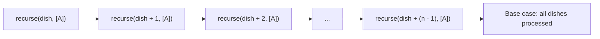
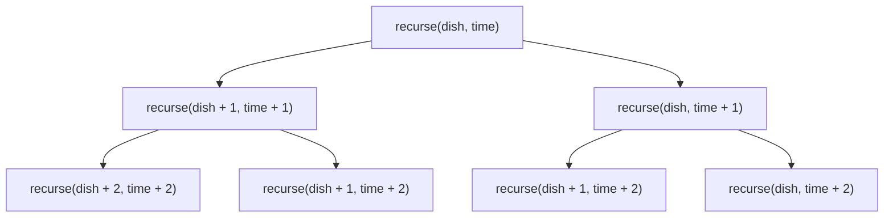
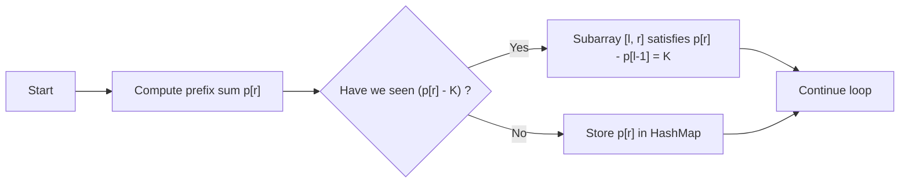
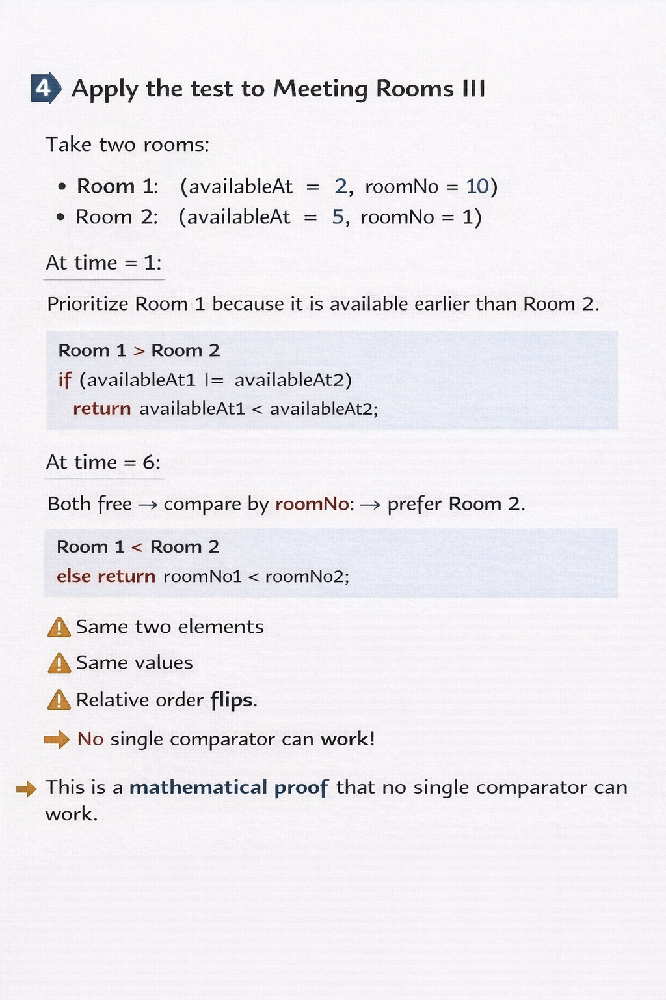
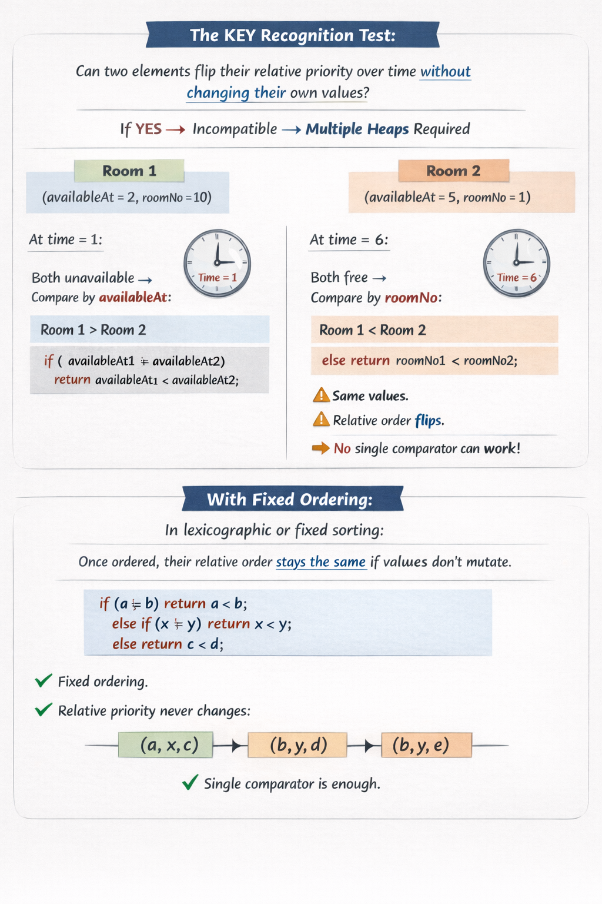

# DSA
Codes + problem explanation

## TODO
1) Figure out if cumulative sum / prefix sum could work with memoisation, memoisation that I write is from (0 -> n), but as recursion stores answer during the 2nd pass(during backtracking) it stores the answer (n -> level), so the memo[level] = lower part of tree (level -> n OR n -> level). Iterative DP, does 1 pass stores the answer from (0-> level) in memo[level]. So a valid workaround could be to write recursion from (n -> 0), so that the answer being stored in memo[level] is from (0-> level), which would make it analogous to iterative version. (If possible, then solve Flowers(CF) and Python Indentation(CF) again but with memo)

2) Practice JUMP DP questions more or the DP questions where memo keys can be dropped via loop or binary search. DO BOTH - COAXIAL / SUBSEQUENCE WITH JUMPS (SORT ON 1 PARAM, binary search on that sorted param with another param being the query, like PROJECTS CSES) and 2 AXIS (LIS TYPE, sort in 1 direction, LIS on OTHER)

3) IMPORTANT OBSERVATION-
### Assign less things to more people => generates PERMUTATION and you have track state of assignment into further states.
**Permutation or state tracking are enemies of DP, you cannot optimise:**
1) permutation = each path in tree, is unique => so no common subproblems
2) state tracking = If you maintaining states of objects (visited / used array in recursion, sets to identify which items have been used), it will become part of memo key. But a vector in memo key is less likely to generate LESS OVERLAP BETWEEN SUBPROBLEMS, as there will be many different configurations of the STATE TRACKING ARRAY. So **CONCLUSION**
#### RECURSIVELY SOLUTION POSSIBLE , BAD FOR DP (not possible to write DP)

### Assign more things to less people => Generates CHOICES => will you be assigned or not (INC / EXC).
Much better way to think, as it can be optimised efficiently, as it creates MANY OVERLAPS between SUBPROBLEMS.
Assigning more things, gives each of thing / elements only 2 option: Either be assigned or not
#### RECURSIVELY SOLUTION POSSIBLE , VERY GOOD FOR DP

INTUITIVE THINKING: 
If you have to assign more things to less people OR more boxes to less balls (IFF. there is 1 - 1 mapping, i.e. each person get only 1 item), it is obvious that some things will be left unassigned as #things > #people. So for this to happen, each element will have a choice to be assigned or not, which builds the choice diagram tree or inc/exc tree.

If you have to assign less people to more things or less balls to more boxes, each person will have a choice to pick which item, OR each ball will have a choice to go to which box. Which essentially generates permutations or permutation tree.

**IMPORTANT VIDEO REFERENCE** 
#### {FUCKING CRAZY DO WATCH THIS, NEVER REALISED WHAT THE IMPORTANCE OF THOSE PERMUATION COMBINATION VIDEOS WERE & HOW IMPORTANT THEY ARE TO WRITE GOOD VS BAD DP SOLUTION}

PEPCODING RECURSION LEVEL 2 (Generate permutation choices for r balls in N boxes & combination choices for N boxes to be assigned to r balls), where N > r
[https://www.youtube.com/watch?v=QKkHCS5bq0I&list=PL-Jc9J83PIiHO9SQ6lxGuDsZNt2mkHEn0&index=20]{permutation generation}
[https://www.youtube.com/watch?v=wOaxJAtJ2Mo&list=PL-Jc9J83PIiHO9SQ6lxGuDsZNt2mkHEn0&index=21] {combination generation}


**IMPORTANT PROBLEM**
CHEF MONOCARP CODEFORCES / ASSIGNMENT DP 
Observation 1: #number of dishes < #number of timeslots
(**NOT EVERY** TIME SLOTS IS GOING TO BE USED, BUT **EVERY** DISH NEEDS TO BE TAKEN OUT)

This problem if to be solved via recursion, can be solved in both ways:
1) assign less dishes to more timeslots
2) assign more timeslots to less dishes

1st Method:
Assign less to more => Assign EACH dish A time slot => Ask, CURRENT DISH SHOULD BE TAKEN OUT AT WHAT TIMESLOT?
GENERATES PERMUTATION in terms of timeslots => "is dish ko kis time pe nikalu?"
NEEDS STATE TRACKING for timeslots, so that other dishes can be taken out at other unique timeslots.

**MEMO KEY => memo(dish, [A]), where [A] = [State Array] like visited/used**
**Quick View to general recursive structure:**
recurse(dish, [A]){
//base case
(dish >= dishes.size() / [A].size() == dishes.size()){
  
}
for([state array] from 1 : M){
  try timeslot1:
  try timeslot2:
  .
  .
  .
  .
  try timeslot M
}

**Recursive call stack (Method 1)**



DP not possible, bad dp because less overlap between subproblems because state tracking will be a part of memo key.


**2nd Method**

Assign more to less => Assign time slot to EACH dish => Ask, DO WE TAKE OUT THE CURRENT DISH OR NOT, at timeslot T.
Generates choices for timeslots, => "iss current time T pe current dish D nikalu ya na nikalu?"
MEMO KEY => memo(dish, time)

**Quick View to General recursive structure:**
recurse(dish, time){
//base case / ALL DISHES PROCESSED.
(dish >= dishes.size()){
  return;
}

//TAKE OUT / INC
recurse(dish + 1, time + 1);

//NOT TAKE OUT / EXC
recurse(dish, time + 1);
}


**Recursive call stack (diagram)**


                              


# 🌉 Prefix Sum + HashMap vs Two Pointer Sliding Window

## 🔍 Core Intuition

Many subarray problems ask you to find:
- The **number of subarrays**
- The **longest/shortest subarray**
- Or **check existence** of a subarray  
  …that satisfies some *cumulative property* (sum, XOR, balance, etc.)

Depending on *how the subarray property behaves*, we use one of two main tools:

| Technique | Works Best When | Core Idea |
|------------|----------------|------------|
| 🧭 **Two Pointer Sliding Window** | Property behaves **monotonically** (e.g., non-negative numbers, growing sum) | Expand & shrink a window greedily |
| 🧩 **Prefix Sum + HashMap** | Property is **exact**, **non-monotonic**, or includes **negatives / varying directions** | Store *prefix state* and check if a *matching earlier prefix* exists |

---

## 🧠 Deep Intuition Behind Prefix Sum + HashMap

### 🧮 The Tiny Algebraic Core

Define **P[i]** = some prefix function of the array up to index *i* (usually inclusive).  
Common choices include:

| Type | Definition | Symbolic form |
|------|------------|---------------|
| 🧾 Prefix Sum    | P[i] = sum of nums[0..i] | additive |
| 🔢 Prefix Count  | P[i] = count of odd numbers in nums[0..i] | additive |
| ⚡ Prefix XOR    | P[i] = xor of nums[0..i] | bitwise |


---

#### 🧩 Key Identity (for any subarray [l..r]):

| Type | Property of subarray [l..r] |
|------|-----------------------------|
| Additive prefix | P[r] − P[l−1] |
| XOR prefix      | P[r] ⊕ P[l−1] |


That is:

> The property of a subarray is **expressible as a difference (or xor) of two prefix values.**  
> That simple algebraic fact **is the whole prefix trick.**

---

### 🗺️ Why the HashMap?

If you want subarrays whose property equals a target **K**, then:

P[r] - P[l-1] = K  ⇒  P[l-1] = P[r] - K

So, for each `r`, you only need to know **how many previous prefixes** have value `P[r] - K`.

A **hashmap** (frequency map) that stores counts of prefix values answers that in **O(1)** time —  
no window shrinking, no scanning, just direct algebraic lookup.

---

Imagine an array:

[ 3, 4, -7, 1, 3, 3, 1, -4 ]

We want to know if there exists a subarray with **sum = 7**.


### 🧩 Step 1: Define the Prefix

Let’s define  
\[
p[i] = \text{sum of all elements from index 0 to i}
\]  

This is the **Prefix Sum Array**.  
It represents the total accumulated sum up to each index.

| Index | Num | Prefix p[i] |
|:------:|:----:|:------------:|
| 0 | 3 | 3 |
| 1 | 4 | 7 |
| 2 | -7 | 0 |
| 3 | 1 | 1 |
| 4 | 3 | 4 |
| 5 | 3 | 7 |
| 6 | 1 | 8 |
| 7 | -4 | 4 |

---

### 🧭 Step 2: Key Subarray Property

A subarray spanning **[l, r]** (inclusive) has sum `k` **iff**  

\[
p[r] - p[l-1] = k
\]

That means:

\[
p[l-1] = p[r] - k
\]

So, if at index `r` you know the current prefix sum `p[r]`,  
and you’ve seen **a previous prefix sum equal to (p[r] − k)** before,  
then the subarray **(l → r)** has the desired sum `k`.

---

### 🧮 Step 3: HashMap Implementation

We can use a HashMap to store how many times each prefix sum has appeared so far.

```cpp
unordered_map<int,int> mp;
mp[0] = 1;   // base: subarray starts from index 0
int sum = 0, count = 0;

for (int x : nums) {
    sum += x;
    if (mp.find(sum - k) != mp.end())
        count += mp[sum - k];
    mp[sum]++;
}
```


You’re not tracking a “window”; you’re tracking states of cumulative progress
and checking if the current state “connects back” to a previously seen state
forming a valid subarray.


| Trigger                                    | Example Question                                 | Why 2-pointer Fails           | Why Prefix Works                 |
| ------------------------------------------ | ------------------------------------------------ | ----------------------------- | -------------------------------- |
| 🎯 “**Exact**” subarray property           | Subarray Sum = K                                 | Sum can rise & fall           | Can check (prefix - k) existence |
| 🔁 **Cyclic / difference-based** condition | Equal number of 0s and 1s                        | No monotonic property         | Convert 0→−1 → check sum=0       |
| ⚖️ **Balance or parity** tracking          | Longest balanced parentheses / vowels / even-odd | Requires pattern reappearance | Use hash of balance states       |
| 🧮 **Prefix XOR / prefix mod**             | Subarray with XOR = K / divisible by K           | XOR not monotonic             | (prefix XOR) relation helps      |


---

### 🧩 2️⃣ When To Use Prefix Sum + HashMap

✅ **Use When the Condition is “EXACT”**  
If you need *exactly K*, *equals target*, or `sum == value`,  
prefix + hashmap is your go-to.

✅ **When Property is Representable as Prefix Difference**
- prefix sum  
- prefix count (like # of odds)  
- prefix xor  
- prefix mod K (for divisibility)

❌ **Don’t Use When**
- The condition depends on a range’s monotonic property (like ≤ K or ≥ K).  
- The property requires continuous shrinking/expanding — then use **two pointers** instead.

---

### ⚔️ 3️⃣ Prefix + HashMap vs Two Pointer (Sliding Window)

| Aspect | Prefix + HashMap | Two Pointer / Sliding Window |
|:-------|:-----------------|:------------------------------|
| **Primary Trigger** | “Exactly K” or “Sum == Target” | “At most K”, “min/max window satisfying condition” |
| **Core Property** | Difference of two prefix values | Contiguous segment satisfying monotonic condition |
| **Works with negatives?** | ✅ Yes (no monotonicity needed) | ❌ No (breaks expansion logic) |
| **Guarantees subarray nature?** | By prefix difference (mathematically guaranteed) | By explicit window boundaries |
| **Space complexity** | O(#unique prefix values) | O(1) or O(window content) |
| **Best suited for** | Counting subarrays, equality constraints | Finding min/max lengths, at-most conditions |
| **Form of condition** | `f(r) - f(l-1) == K` | “Shrink until invalid” |
| **Typical result** | Count or existence of subarrays | Minimal/maximal length of subarray |

---

### 🌈 4️⃣ Common Patterns Using Prefix + HashMap

| Problem | Prefix Definition | Complement Logic |
|:---------|:------------------|:-----------------|
| 🎯 Subarray Sum = K | Prefix sum | Need prefix − K |
| 🧮 Binary Subarrays with Sum = K | Count of 1s | Need count − K |
| ⚖️ Exactly K Odd Numbers | Count of odds | Need prefix − K |
| 🌗 Equal 0s & 1s | Prefix sum of (+1/−1) | Need prefix == 0 |
| 🧠 Subarray XOR = K | Prefix XOR | Need prefix ⊕ K |
| 🔁 Sum divisible by K | Prefix sum % K | Need same remainder |
| 🔡 Balanced string (#a == #b) | Count difference (a−b) | Need same prefix diff |

---

### 🧭 5️⃣ Mental Model — “Complement Search vs Segment Shrinking”

**Prefix + HashMap →** You’re searching for *matching past states*  
**Sliding Window →** You’re maintaining a *live valid segment*

Think of **prefix-sum** as taking snapshots of the array’s cumulative state;  
think of **two-pointer** as *living inside* the current valid state.

---

### 🪄 6️⃣ Quick Recognition Checklist (Triggers)

| Situation | Prefer |
|:-----------|:--------|
| ❓ Need “exactly K” of something | Prefix + HashMap |
| 🧮 Need sum / xor / mod == target | Prefix + HashMap |
| ⚙️ Elements can be negative | Prefix + HashMap |
| 🧱 Need “at most K” / “minimum window” | Two Pointers |
| 🔢 Monotonic property (e.g. sum increases) | Two Pointers |

---

---

## 🧠 LCS-Family DP Trigger (Short Rule)
Whenever a problem asks for subsequences and
forces a 1–1 operation between two sequences in order
(match / multiply / cost / score),
use LCS-style recursion:

• skip left
• skip right
• take both

## 🧠 LCS-Family DP Trigger (Formal Rule)
If a problem requires building two subsequences of equal length and
each element of one is paired with exactly one element of the other
in order,
then it belongs to the LCS-family of dynamic programming problems.
**Good Beginner Variant** - https://leetcode.com/problems/max-dot-product-of-two-subsequences/

---
## JUMP DP / DP + Binary Search
(problem discussed = LC 646 (Maximum Length of Pair Chain))
Why all valid paths are still considered

My doubt

After choosing a pair (a, b) at index i, I compute:

nextIdx = first index j such that pairs[j][0] > b


Now, all indices j ≥ nextIdx are valid choices.

What I was unsure about was this:

What if I jump to a nextIdx where a is small but b is very large?

That large b could reduce the chances of picking further pairs.

Am I missing better chains by not explicitly trying all j ≥ nextIdx?

My own reasoning

I realized that even if I jump to nextIdx, I am not forced to take it.

From nextIdx, DP again has two choices:

include

exclude

So if pairs[nextIdx] is a bad choice (because its b is too large), the DP can simply exclude it.

Excluding at nextIdx would be equivalent to moving to nextIdx + 1, which is the same as if I had directly tried that index from the original position.

So all valid future indices are still reachable.

Restating why this reasoning is correct

This intuition is exactly right.

Jumping to nextIdx does not mean choosing that pair.
It only means entering the valid region.

Formally:

1 + dp[nextIdx]
= max over all valid j ≥ nextIdx of (1 + dp[j])


Even if pairs[nextIdx] has a horrible b and ruins future extensions:

DP will exclude it

try dp[nextIdx + 1]

then dp[nextIdx + 2]

and so on

No valid chain is skipped.

Visual intuition

After choosing index i:

i   x   x   x   |   j1   j2   j3   j4 ...
                 ^
               nextIdx


x → invalid (a ≤ b)

j1, j2, j3... → valid

By jumping to j1:

I am not committing to j1

I am only entering the valid zone

Inside that zone, DP still decides:

include j1

or exclude and go to j2

or exclude again and go to j3

…

So no valid option is lost.

Key sentence (validated)

“If I exclude after going to nextIdx, it would be the same as going to nextIdx + 1 from the current index.”

This is the exact invariant that makes Jump DP / DP + Binary Search correct.

Final takeaway

Binary search only skips provably invalid states

Inclusion + exclusion guarantees all valid paths

Jumping sets a boundary, not a decision

This is a safe and standard Jump DP optimization

### Original question for BITMASK and other good DP questions in link
https://leetcode.com/problems/maximum-profit-from-valid-topological-order-in-dag/solutions/6689419/javacpython-mask-dp-by-lee215-pfmk/ (solve questions in this link, remove after solving)


## 2 Heap Problems (Simulation, Scheduling etc)
1) [LC 295. Find Median from Data Stream](https://leetcode.com/problems/find-median-from-data-stream/) (Online input, simulating an ordered sequence element in two balanced halves)!

2) [LC 2402 Meeting Rooms III](https://leetcode.com/problems/meeting-rooms-iii/description/) (Scheduling Problem)
About this problem - [Read this excellent conversation between me and GPT](https://chatgpt.com/share/6967cf2f-2af0-8012-abef-7ea80d16923a)

#### Chat CRUX - 
<p align="center">

</p>
<p align="center">

</p>


## GREEDY PROBLEMS (INTUITION, PROBLEMS, EXPLANATIONS & VIDEOS)
1) Good Beginner Question - [LC 1266. Minimum Time Visiting All Points](https://leetcode.com/problems/minimum-time-visiting-all-points/description/)
   
DO READ [LC OFFICIAL EDITORIAL](https://leetcode.com/problems/minimum-time-visiting-all-points/editorial/), good for developing template for greedy problems, how to distinguish between greedy and dp.

For this questions my thoughts, were if there were OPTIONS to jump to some other point (not having to follow restriction to visit all points in order), then we could have used dp, as there would be options for each point on where to go next such that it minimises the total time. But because of the order property, we don't have any options, so recursion tree would be linear and not branched, so no point of optimising a linear tree (factorial recursion)\

/*
GREEDY APPROACH - Move diagonally as much as possible
Because we have to visit each point in ORDER, if we consider each pair of adjacent points as a segment, each segment is entirely independent. 
Our decisions within the current segment do not affect the decisions in other segments. 
Therefore, the optimal solution for this problem consists of the optimal solutions for each individual segment. 
To solve this problem, the first thing we need to determine is the optimal strategy for moving between adjacent points.
*/

Think of some greedy strategy first, here - move diagonally as much as possible, to come up with this, see test cases, make diagrams, often these are the INTRUSIVE THOUGHTS (diagonal increases both row & column by 1, where as the straight moves only increase either dimension by 1, SO PROFITABLE IF USED OPTIMALLY).
INTRUSIVE THOUGHTS - SO PROFITABLE IF USED OPTIMALLY

Then see if based on some problem constraint, if you follow this approach for current pair, would it affect the future (DP)/would it affect the decisions for other pairs/segments/points/intervals? If NO, then we could choose optimally for each pair/segment/interval individually, which is greedy only.


